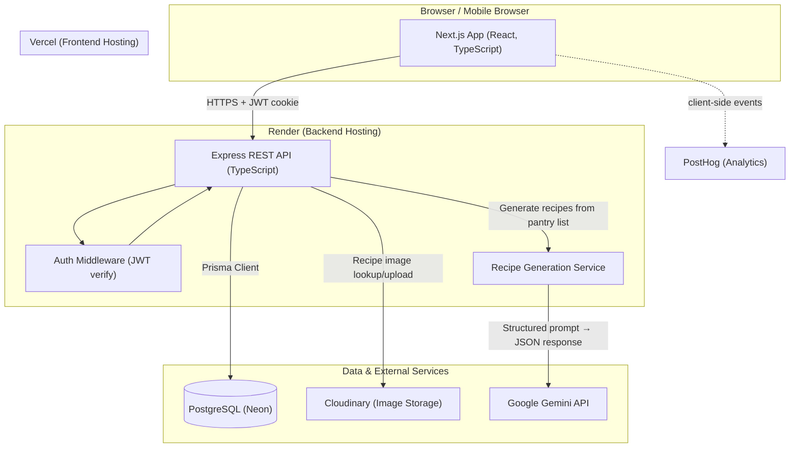
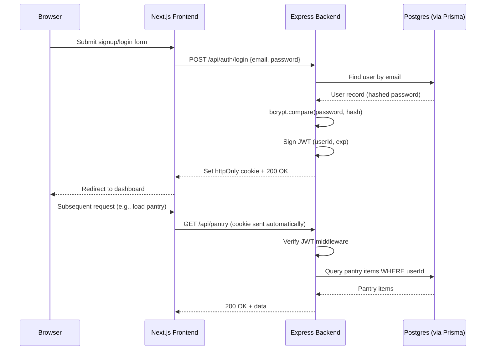
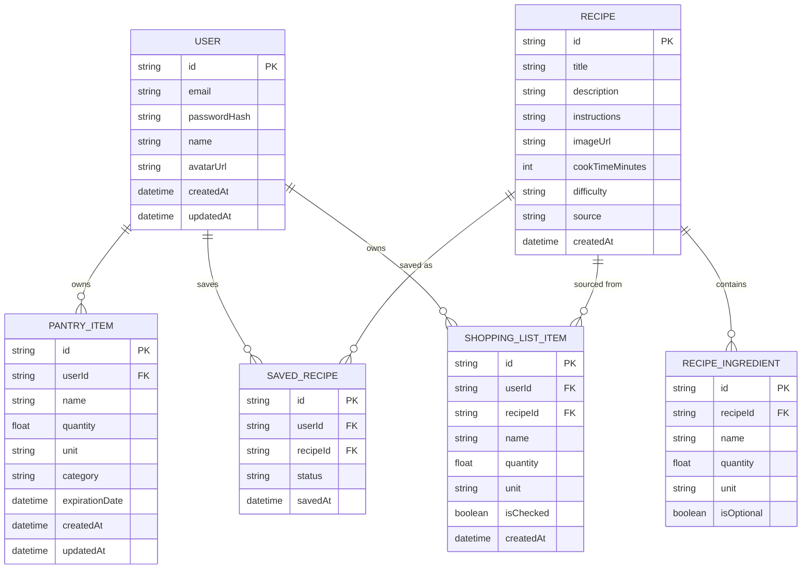
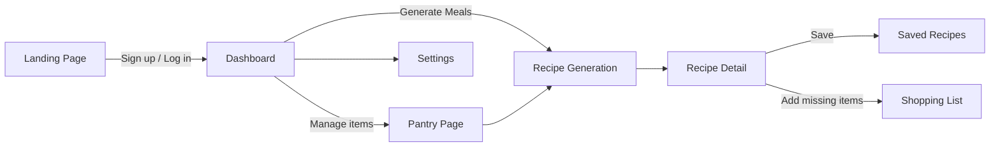

# ShelfMatch

**Find meals from what you already have.**

ShelfMatch is a full-stack web app that answers one question fast: *"What can I make right now?"* You tell it what's in your fridge or pantry, and it generates realistic meals you can cook immediately — no grocery run, no scrolling through recipes that need six ingredients you don't have.

This README is the complete blueprint for the project: problem, features, stack, architecture, schema, folder layout, build phases, API design, UI flow, deployment, and resume framing. Read it top to bottom before writing code — every later section assumes the decisions made in earlier ones.

---

## Table of Contents

1. [Project Overview](#1-project-overview)
2. [Feature Roadmap](#2-feature-roadmap)
3. [Tech Stack](#3-tech-stack)
4. [Architecture](#4-architecture)
5. [Database Design](#5-database-design)
6. [Folder Structure](#6-folder-structure)
7. [Development Roadmap](#7-development-roadmap)
8. [API Design](#8-api-design)
9. [UI/UX Planning](#9-uiux-planning)
10. [Deployment](#10-deployment)
11. [Resume Value](#11-resume-value)
12. [Cost Constraints](#12-cost-constraints)

---

## 1. Project Overview

### Problem Statement

People throw away food constantly — not because they don't care, but because deciding what to cook with what's already on hand is genuinely annoying. Recipe sites assume you're shopping *for* a recipe, not cooking *from* your fridge. Search "chicken, rice, broccoli" on a recipe site and you get results that also need five ingredients you don't have. The result: people default to takeout or a grocery run, and the food they already own goes bad.

### Solution

ShelfMatch flips the recipe-search model. Instead of "search for a recipe, then buy ingredients," it's "tell us your ingredients, get a recipe." The user inputs what they have (typed, selected from a list, or eventually scanned), and the app — using an LLM plus a small ranking layer — returns a short list of realistic meals ranked by how well they match what's on hand, what's about to expire, and how little extra shopping is needed.

### Target Users

- **Home cooks who hate waste** — people who feel guilty throwing out wilting vegetables or expired sauces.
- **Budget-conscious cooks** — students, young professionals — who want to stretch groceries further instead of buying more.
- **Low-effort planners** — people who don't enjoy meal planning and want a fast, low-friction answer rather than a Pinterest board.

### Goals

- Make "what can I cook right now" answerable in under 30 seconds.
- Reduce the number of ingredients that expire unused.
- Keep the interaction lightweight — adding pantry items and generating a meal should feel like two taps, not a form.
- Build something genuinely useful enough that *you* would use it daily, since that's the best test of product quality.

### Why This Project Is Valuable

For the user: less wasted food, less money spent, less daily decision fatigue. For you as the builder: it's a project with a real, relatable problem (not another todo app or clone), a natural place for AI integration that's actually justified by the product (not bolted on), and enough surface area — auth, CRUD, relational data, external API calls, deployment — to demonstrate full-stack range without ballooning into something unfinishable.

---

## 2. Feature Roadmap

### MVP (must-have)

| Feature | Why it exists | Problem it solves | User interaction |
|---|---|---|---|
| **Account creation & login** | Pantry data is personal and persistent; needs to survive across sessions/devices | Without accounts, pantry data resets every visit | Email/password signup and login form, persisted session |
| **Add/edit/remove pantry items** | Core data the whole app is built on | Users need a fast way to record what they own | Form or quick-add input with name, quantity, unit, optional expiration date |
| **Pantry list view** | Users need to see/manage what they've logged | Otherwise pantry data is invisible and untrustworthy | Scrollable list/grid, grouped by category, with edit/delete actions |
| **"Generate meals" action** | This *is* the product | Core question: what can I cook right now | Button on dashboard; sends current pantry to backend, returns 3-5 recipe suggestions |
| **Recipe detail view** | User needs steps, not just a title | A recipe name alone isn't cookable | Click a suggestion → see ingredients (have vs. missing), steps, estimated time |
| **Missing-ingredient indicator** | Differentiates ShelfMatch from generic recipe search | Users need to know what they're missing before committing to a recipe | Each recipe shows "you have 4/5 ingredients" with the missing one highlighted |
| **Save/favorite a recipe** | Users want to return to meals that worked | Without saving, every good result is a one-time AI lookup, lost forever | Heart/save icon on recipe card and detail view |
| **Responsive UI (mobile + desktop)** | People check "what can I cook" standing in the kitchen, on their phone | A desktop-only app is unusable in the one place this app matters most | Standard responsive layout, no separate mobile app needed |

### Nice-to-have

| Feature | Why it exists | Problem it solves | User interaction |
|---|---|---|---|
| **Expiration tracking + "use soon" sorting** | Waste reduction is the actual mission, not just convenience | Without urgency signals, users still let things expire | Pantry items flagged/sorted by days-until-expiration; expiring items boosted in recipe ranking |
| **Shopping list generation** | Recipes often need 1-2 extra items | Bridges "almost have it" to "fully have it" | "Add missing ingredients to shopping list" button on a recipe |
| **Recipe filters (cuisine, diet, time, difficulty)** | Same pantry, different context (quick weeknight vs. weekend cooking) | Generic suggestions don't fit every situation | Filter chips above the generate button |
| **Pantry categories & quick-add presets** | Manual entry is the biggest friction point | Typing "garlic," "onion," "olive oil" every time is tedious | Common-items grid the user taps instead of typing |
| **Recipe rating/feedback loop** | Improves perceived recipe quality over time | AI suggestions vary in quality; feedback gives signal | Thumbs up/down on a recipe after viewing, stored for future ranking tweaks |

### Future Improvements

| Feature | Why it exists | Problem it solves | User interaction |
|---|---|---|---|
| **Photo-based pantry input (AI vision)** | Typing every item is still real friction | Speeds up pantry entry from minutes to seconds | Snap a fridge/pantry photo → AI extracts a list of likely items for the user to confirm |
| **Barcode scanning** | Faster, more accurate than vision-only for packaged goods | Vision models struggle to read exact product names | Scan barcode with phone camera → auto-fill item name via a product lookup API |
| **Meal planning calendar** | Extends from "right now" to "this week" | Users who batch-plan want a weekly view, not just instant answers | Drag saved/generated recipes onto a weekly calendar |
| **Grocery delivery integration** | Removes the last friction step (going to the store) | Shopping list still requires a manual store trip | "Order missing items" button linking out to a delivery service API |
| **Social/sharing features** | Increases engagement | Cooking is often a shared/social activity | Share a recipe link, or a public profile of favorite recipes |
| **Nutrition tracking** | Expands value beyond waste reduction into health | Some users care about calories/macros, not just waste | Auto-computed nutrition info per recipe, optional daily summary |

---

## 3. Tech Stack

The guiding principle: **boring, proven, widely-used technology for the core, with one well-justified AI integration** — not a stack assembled to look impressive. Every choice below has a stated alternative and tradeoff so you can defend it in an interview.

| Layer | Choice | Why | Alternatives considered | Tradeoffs |
|---|---|---|---|---|
| **Frontend framework** | **Next.js (React, App Router, TypeScript)** | Industry-standard React meta-framework; file-based routing, built-in image optimization, server components, and a near-zero-config deploy to Vercel. Far and away the most commonly listed frontend framework in job postings right now. | Vite + React (lighter, no SSR baggage), Remix (similar tradeoffs to Next.js), SvelteKit (smaller, less common in job postings) | Next.js has more concepts to learn (server vs. client components, routing conventions) than plain Vite+React. Worth it here because Vercel's free tier is built specifically around it. |
| **Backend framework** | **Node.js + Express (TypeScript)** | Deliberately kept separate from Next.js API routes so the project has a real, independently-deployed REST API — this is what makes "API design" a genuine, demonstrable skill on your resume rather than a few route handlers in a Next.js folder. Express is minimal, unopinionated, and the most universally recognized Node backend choice. | Next.js API routes (simplest, monolith, no CORS to manage), NestJS (more structure/DI, steeper learning curve, very resume-relevant at larger companies), Fastify (faster, smaller ecosystem) | A separate backend means managing CORS and two deployments instead of one. Chosen anyway because it better demonstrates full-stack architecture and is closer to how real companies split frontend/backend teams. |
| **Database** | **PostgreSQL** | The data here is inherently relational — users have many pantry items, recipes have many ingredients, users have many saved recipes through a join table. Postgres is the industry-standard RDBMS and the most transferable SQL skill to have. | MongoDB (more flexible schema, but the relationships here don't benefit from that flexibility and you'd just reinvent joins in application code), SQLite (fine for local dev, not great for a hosted multi-user app) | Postgres requires schema migrations as the data model evolves — more upfront design than a schemaless DB, but that rigor is exactly what's worth learning. |
| **ORM** | **Prisma** | Type-safe queries generated from a single schema file, best-in-class migration tooling (`prisma migrate`), and the most widely adopted TypeScript ORM — meaning the most tutorials, the most StackOverflow answers, the fewest dead ends. | Drizzle ORM (lighter, more SQL-like, growing fast — worth learning *after* this project), raw SQL with `pg` (maximum control, no type safety, more boilerplate) | Prisma's generated client adds a build step and some "magic"; Drizzle is more transparent. Prisma wins here for development speed and documentation depth on a first full-stack project. |
| **Authentication** | **JWT-based auth, built by hand (bcrypt + jsonwebtoken), stored in an httpOnly cookie** | Because the backend is a separate Express API, a hand-rolled JWT flow is genuinely simple to implement and — critically — *teaches you how auth actually works* (hashing, token signing, refresh tokens, middleware guards). That's a much stronger interview answer than "I added Clerk." | Clerk / Auth.js (NextAuth) — fast to set up, handle OAuth/social login out of the box, generous free tiers, but abstract away the mechanics | Hand-rolled auth means you own bugs around token expiry, refresh, and revocation. Acceptable tradeoff for a learning-focused project; if you later add Google OAuth, layer Auth.js on top rather than replacing this. |
| **Image storage** | **Cloudinary** | Free tier (25 GB storage/bandwidth) with built-in image transforms/resizing on the fly — useful for recipe images and (later) pantry photo uploads. Independent of your DB/hosting provider, so it doesn't lock you into one vendor. | Supabase Storage (convenient if also using Supabase for Postgres), AWS S3 (free for 12 months only, then billed — risky for a long-lived portfolio project) | One more service/API key to manage versus bundling storage with your DB provider. Worth it for the permanence of the free tier (not time-limited like S3's). |
| **AI integration** | **Google Gemini API (`gemini-2.0-flash` or newer flash tier)** for recipe generation, called from the Express backend | Gemini's Flash tier has a genuinely free usage tier suitable for a personal project (rate-limited but $0), unlike OpenAI/Anthropic which are pay-as-you-go from the first token. The backend sends the user's pantry list and gets back structured JSON (recipe title, ingredients used/missing, steps, estimated time). | OpenAI API (`gpt-4o-mini`) and Anthropic Claude API (`claude-haiku`) — both excellent quality and cheap, but not free; good upgrade path once the project has real usage or you're comfortable spending a few dollars a month. Local models via Ollama — fully free but impractical on free-tier hosting (no GPU/RAM for it). | Free-tier rate limits mean you should cache/dedupe identical pantry queries (see [Resume Value](#11-resume-value)) and design a graceful fallback if the API is rate-limited. Worth explicitly mentioning in interviews: you chose the free option deliberately and engineered around its limits, rather than not knowing better. |
| **Hosting — frontend** | **Vercel** | Built by the makers of Next.js; zero-config deploys from a GitHub push, free SSL, free subdomain, generous free tier for personal projects. | Netlify (also great, slightly less Next.js-native), Cloudflare Pages (fast, free, less mature Next.js support) | None significant at this scale. |
| **Hosting — backend** | **Render (free web service tier)** | Deploys a Dockerized or native Node app directly from GitHub, free tier available, supports environment variables and auto-deploy on push. | Railway (no longer has a true free tier — trial credit only, then billed), Fly.io (free allowance but more manual config), Heroku (no longer offers a free tier) | Render's free tier spins the service down after ~15 minutes of inactivity, causing a 30-60s "cold start" on the first request. Acceptable for a portfolio project; mention it proactively in a demo ("first load may take a moment, it's a free-tier cold start") rather than letting it look like a bug. |
| **Database hosting** | **Neon** (serverless Postgres) | Generous free tier, true serverless Postgres (scales to zero, no idle cost), branching for dev/preview databases — a genuinely modern feature worth knowing. | Supabase (free Postgres + bundled auth/storage — viable if you want fewer vendors), Railway Postgres (tied to Railway's no-longer-free tier) | Neon is DB-only — no bundled auth/storage like Supabase. That's fine here since auth is hand-rolled and storage is on Cloudinary anyway. |
| **API testing** | **Postman** | Industry-standard tool for manually testing and documenting REST endpoints during backend development; collections double as living API documentation. | Thunder Client (lightweight VS Code extension, good for solo quick checks), Insomnia (similar to Postman) | None significant; Postman collections are also a nice artifact to link from your README/portfolio. |
| **Version control** | **Git + GitHub** | Non-negotiable industry standard. | — | — |
| **Styling / UI library** | **Tailwind CSS + shadcn/ui** | Tailwind is the dominant utility-CSS approach in modern React codebases; shadcn/ui provides accessible, unstyled-by-default component primitives (built on Radix) that you copy into your codebase and own — not a black-box dependency. This combination is what most current React job postings and bootcamps standardize on. | Chakra UI / MUI (full component libraries, faster to start, harder to deeply customize, look more "templated"), plain CSS Modules (full control, much slower to build with) | Tailwind has a learning curve around utility-class verbosity; shadcn/ui means you maintain the component code yourself (a pro for learning, a con for raw speed). |
| **State management** | **TanStack Query (React Query) for server state + React's built-in `useState`/`useContext` for local UI state** | Almost all state in this app *is* server state (pantry items, recipes, favorites) — TanStack Query handles caching, refetching, and loading/error states for that automatically. Redux/Zustand would manage state that doesn't really need a global client store here. | Zustand (good lightweight option if client-only state grows complex later — e.g., a multi-step recipe-generation wizard), Redux Toolkit (overkill for this app's size) | If a complex client-only flow emerges later (e.g., meal-planning calendar drag state), add Zustand then rather than reaching for it prematurely. |
| **ORM-adjacent: Validation** | **Zod** | Single source of truth for validation schemas, usable on both the Express backend (validate request bodies) and the Next.js frontend (validate forms via `react-hook-form` + `@hookform/resolvers/zod`). TypeScript-first, infers static types from schemas. | Yup (older, similar feature set, weaker TS inference), Joi (backend-only, no first-class TS types) | None significant; Zod is close to a default choice in the current TS ecosystem. |
| **CI/CD** | **GitHub Actions** | Free for public repos (and generous free minutes for private ones); runs lint/typecheck/test on every push and PR, gating merges. Vercel and Render both auto-deploy on push independently, so Actions here is purely for quality gates, not deployment itself. | CircleCI, GitLab CI (irrelevant if hosted on GitHub) | None significant. |
| **Analytics** | **PostHog (free tier, self-serve cloud)** | Real product analytics (funnels, session data, feature usage) rather than just pageviews — meaningfully more impressive in an interview than "I added Google Analytics," and the free tier (1M events/month) is far more than a portfolio project needs. | Vercel Analytics (simpler, pageview-level only, bundled with hosting), Plausible (privacy-focused, free tier is trial-only) | PostHog's free tier requires usage-based opt-in to certain features; stick to core event tracking and you stay comfortably within the free quota. |

---

## 4. Architecture

### Overview

Two independently deployed services — a Next.js frontend and an Express REST API — talking over HTTPS, backed by a managed Postgres database. The AI call is server-side only (the frontend never talks to Gemini directly), which keeps the API key secret and gives you a single place to add caching, rate-limiting, and fallback logic.



### Frontend

Next.js App Router, organized by route (`/dashboard`, `/pantry`, `/recipes/[id]`, etc.). Server Components fetch initial page data where it makes sense (e.g., the pantry list on first load); client components handle interactive pieces (forms, the "Generate Meals" button, favoriting). All API calls go through a small typed API client wrapper, with TanStack Query managing caching/loading/error state on top of it.

### Backend

Express app organized by feature (routes → controllers → services → Prisma). The recipe-generation service is intentionally isolated: it owns the prompt template, the Gemini API call, response parsing/validation (with Zod, since LLM output must be treated as untrusted input), and a fallback path if the AI call fails or is rate-limited. Auth is a small middleware that verifies the JWT cookie and attaches `req.userId` to downstream handlers.

### Database

PostgreSQL accessed exclusively through Prisma from the backend. The frontend never talks to the database directly — all access is mediated by the REST API, which keeps authorization logic in one place.

### AI Flow

1. User taps "Generate Meals" on the dashboard.
2. Frontend sends the user's current pantry items (names + quantities) to `POST /api/recipes/generate`.
3. Backend builds a structured prompt instructing Gemini to return strict JSON: a list of recipes, each with a title, used ingredients, missing ingredients, steps, and estimated time.
4. Backend validates the JSON response against a Zod schema (LLMs occasionally return malformed output — never trust it blindly).
5. Backend optionally persists the generated recipes (so a saved/favorited recipe has a stable ID) and returns the validated list to the frontend.
6. Frontend renders recipe cards from the response.

### External APIs

- **Google Gemini API** — recipe generation (core AI feature).
- **Cloudinary API** — image upload/transform (recipe images, and later, pantry photo uploads).
- **(Future) Barcode/product lookup API** — for the barcode-scanning future feature.

### Authentication Flow



---

## 5. Database Design



### Models & Relationships

- **User → PantryItem (1:many).** Each pantry item belongs to exactly one user. Deleting a user cascades to their pantry items.
- **User → SavedRecipe → Recipe (many:many through a join table).** `SavedRecipe` is the join table between users and recipes, and deliberately covers both "Favorites" and "Saved Meals" from the original feature list via a `status` enum (`FAVORITE`, `COOKED`, `PLANNED`) rather than two separate tables. This avoids duplicate join tables for what is structurally the same relationship (a user bookmarking a recipe for different reasons), and it's trivial to filter by status in a query (`WHERE status = 'FAVORITE'`).
- **Recipe → RecipeIngredient (1:many).** Each recipe's ingredient list is normalized into its own table rather than a JSON blob, so ingredient names can later be matched/queried against pantry item names (e.g., to compute "you have 4/5 ingredients").
- **User → ShoppingListItem (1:many), optionally linked to a Recipe.** `recipeId` is nullable — a shopping list item can be added manually or generated from "add missing ingredients" on a specific recipe, which the FK traces back to.
- **Expiration tracking** is *not* a separate table — it's the `expirationDate` field directly on `PantryItem`. A dedicated table would only be justified if expiration events needed their own history/audit trail, which they don't for this app.
- **`Recipe.source`** distinguishes AI-generated recipes (`"ai"`) from any future seeded/external recipes (`"external"`), useful once a recipe API (e.g., Spoonacular) is optionally layered in.

This schema is intentionally normalized (not denormalized for read speed) since the dataset size for a personal project is small — normalization keeps the schema easy to reason about and is the right default until you have a measured performance reason to do otherwise.

---

## 6. Folder Structure

Two top-level apps in one repo (no monorepo tooling like Turborepo/Nx yet — that's real complexity not justified at this size; revisit it if the project grows a third app, e.g., a mobile client).

```
shelfmatch/
├── frontend/                      # Next.js app
│   ├── app/
│   │   ├── (auth)/
│   │   │   ├── login/page.tsx
│   │   │   └── signup/page.tsx
│   │   ├── dashboard/page.tsx
│   │   ├── pantry/page.tsx
│   │   ├── recipes/
│   │   │   ├── generate/page.tsx
│   │   │   └── [id]/page.tsx
│   │   ├── saved/page.tsx
│   │   ├── shopping-list/page.tsx
│   │   ├── settings/page.tsx
│   │   ├── layout.tsx
│   │   └── page.tsx                # Landing page
│   ├── components/
│   │   ├── ui/                     # shadcn/ui primitives
│   │   ├── pantry/
│   │   ├── recipes/
│   │   └── layout/
│   ├── lib/
│   │   ├── api-client.ts           # typed fetch wrapper to backend
│   │   ├── validators/             # shared Zod schemas (forms)
│   │   └── utils.ts
│   ├── hooks/                      # TanStack Query hooks (usePantry, useRecipes...)
│   ├── public/
│   └── package.json
│
├── backend/                        # Express API
│   ├── src/
│   │   ├── routes/
│   │   │   ├── auth.routes.ts
│   │   │   ├── pantry.routes.ts
│   │   │   ├── recipes.routes.ts
│   │   │   ├── shopping-list.routes.ts
│   │   │   └── user.routes.ts
│   │   ├── controllers/            # request/response handling per route
│   │   ├── services/
│   │   │   ├── auth.service.ts
│   │   │   ├── pantry.service.ts
│   │   │   ├── recipe-generation.service.ts   # Gemini prompt + parsing
│   │   │   └── shopping-list.service.ts
│   │   ├── middleware/
│   │   │   ├── require-auth.ts
│   │   │   └── error-handler.ts
│   │   ├── validators/             # Zod schemas for request bodies
│   │   ├── prisma/
│   │   │   ├── schema.prisma
│   │   │   └── migrations/
│   │   ├── lib/                    # Cloudinary client, Gemini client, etc.
│   │   └── app.ts                  # Express app setup
│   ├── tests/
│   └── package.json
│
├── .github/
│   └── workflows/
│       └── ci.yml                  # lint + typecheck + test on PR/push
├── docs/
│   └── api-collection.json         # exported Postman collection
└── README.md
```

**Why this shape:** routes/controllers/services separation in the backend keeps HTTP concerns (parsing requests, sending responses) out of business logic (what a "generate recipe" operation actually does), which makes the service layer independently testable and easy to explain in an interview. The frontend mirrors the same "feature folder" instinct inside `components/` so related UI lives together instead of being split arbitrarily by file type.

---

## 7. Development Roadmap

Each phase produces something runnable — avoid the trap of building all the backend before any frontend exists, or vice versa.

1. **Project setup** — Initialize both apps (`frontend/`, `backend/`), TypeScript configs, ESLint/Prettier, Tailwind + shadcn/ui install, Prisma init with a Neon connection string, basic Express server with a health-check route, GitHub repo + Actions skeleton.
2. **Database schema** — Write the full `schema.prisma` from [Section 5](#5-database-design), run the first migration, seed a few sample recipes for early testing before AI integration exists.
3. **Authentication** — Signup/login endpoints (bcrypt hash, JWT issue), `require-auth` middleware, frontend login/signup pages, protected route handling on the frontend (redirect to `/login` if no valid session).
4. **Pantry management** — Full CRUD API for pantry items, pantry list/add/edit/delete UI, this is the first fully working end-to-end vertical slice (UI → API → DB → back).
5. **Recipe generation (AI integration)** — Build the Gemini prompt template, the recipe-generation service with Zod validation of the AI response, the `/recipes/generate` endpoint, and the frontend "Generate Meals" flow with loading/error states. This is the riskiest phase — budget extra time for prompt iteration.
6. **Saved recipes & favorites & shopping list** — `SavedRecipe` CRUD, "add missing ingredients to shopping list" action, saved-recipes and shopping-list pages.
7. **Deployment** — Deploy backend to Render, frontend to Vercel, database on Neon, wire up environment variables and CORS between the two live URLs, verify the full flow works in production (not just locally).
8. **Polish and optimization** — Loading skeletons, empty states, error boundaries, mobile responsiveness pass, basic analytics events, caching identical AI requests (see [Resume Value](#11-resume-value)), write the demo README/screenshots for your portfolio.

---

## 8. API Design

All routes prefixed with `/api`. Protected routes require a valid JWT cookie (enforced by `require-auth` middleware).

### Authentication

| Method | Endpoint | Description |
|---|---|---|
| `POST` | `/api/auth/signup` | Create a new user (hash password, create record, issue JWT cookie) |
| `POST` | `/api/auth/login` | Verify credentials, issue JWT cookie |
| `POST` | `/api/auth/logout` | Clear the auth cookie |
| `GET` | `/api/auth/me` | Return the currently authenticated user's basic profile |

### Pantry CRUD

| Method | Endpoint | Description |
|---|---|---|
| `GET` | `/api/pantry` | List all pantry items for the current user (supports `?sort=expiring` query param) |
| `POST` | `/api/pantry` | Add a new pantry item |
| `PATCH` | `/api/pantry/:id` | Update a pantry item (quantity, expiration, etc.) |
| `DELETE` | `/api/pantry/:id` | Remove a pantry item |

### Recipe Generation

| Method | Endpoint | Description |
|---|---|---|
| `POST` | `/api/recipes/generate` | Send current pantry (or a manually-selected subset) to the AI service, return ranked recipe suggestions |
| `GET` | `/api/recipes/:id` | Get full detail for a single recipe (ingredients, steps) |

### Favorites / Saved Recipes

| Method | Endpoint | Description |
|---|---|---|
| `GET` | `/api/saved` | List the current user's saved recipes (optionally filter by `?status=favorite`) |
| `POST` | `/api/saved` | Save a recipe with a given status (`favorite`, `cooked`, `planned`) |
| `PATCH` | `/api/saved/:id` | Change a saved recipe's status |
| `DELETE` | `/api/saved/:id` | Unsave/remove a recipe from the user's list |

### Shopping List

| Method | Endpoint | Description |
|---|---|---|
| `GET` | `/api/shopping-list` | List the current user's shopping list items |
| `POST` | `/api/shopping-list` | Add an item manually, or in bulk from a recipe's missing ingredients (`recipeId` in body) |
| `PATCH` | `/api/shopping-list/:id` | Toggle checked/unchecked, edit quantity |
| `DELETE` | `/api/shopping-list/:id` | Remove an item |

### User Profile

| Method | Endpoint | Description |
|---|---|---|
| `GET` | `/api/users/me` | Get full profile (name, avatar, account creation date) |
| `PATCH` | `/api/users/me` | Update profile fields (name, avatar) |
| `DELETE` | `/api/users/me` | Delete account and all associated data |

---

## 9. UI/UX Planning

### Pages & Flow

- **Landing page** (unauthenticated) — One clear value statement ("What can I make right now?"), a short explanation, and signup/login CTAs. Goal: get a new visitor into the product in one click, not a marketing scroll-fest.
- **Dashboard** (post-login home) — Snapshot of pantry status (item count, anything expiring soon) and the primary "Generate Meals" call-to-action front and center. This is the page a returning user should land on and immediately know what to do.
- **Pantry page** — List/grid of current pantry items grouped by category, quick-add input at the top, inline edit/delete. Sorting toggle for "expiring soon."
- **Recipe generation page/flow** — Triggered from the dashboard; shows a loading state while the AI call resolves, then a set of recipe cards (title, image, time, % ingredients matched). Optional filter chips (cuisine/time/difficulty) sit above the results.
- **Recipe detail page** — Full ingredient list split into "you have" / "you need," numbered steps, save/favorite button, "add missing to shopping list" button.
- **Saved recipes page** — Saved/favorited recipes, filterable by status (favorite/cooked/planned).
- **Shopping list page** — Checklist UI, items grouped by source recipe where applicable, checkbox to mark purchased.
- **Settings page** — Profile edit (name/avatar), password change, account deletion.

### User Flow



The flow is intentionally shallow — almost every page is reachable in one or two clicks from the dashboard, because the product's whole pitch is *low effort*.

---

## 10. Deployment

All on free tiers — total cost: **$0/month**.

| Component | Service | Free tier notes |
|---|---|---|
| Frontend hosting | Vercel | Free for personal projects; auto-deploy from GitHub `main` branch |
| Backend hosting | Render | Free web service tier; spins down after ~15 min idle (cold start on next request — acceptable for a portfolio demo) |
| Database hosting | Neon | Free tier Postgres, scales to zero when idle, generous storage limit for a personal project's data volume |
| Image storage | Cloudinary | Free tier: 25 GB storage/bandwidth |
| AI API | Google Gemini (Flash tier) | Free usage tier with rate limits, sufficient for demo/personal use |
| Analytics | PostHog | Free tier: 1M events/month |
| Domain | Vercel-provided subdomain (`shelfmatch.vercel.app`) | Free; a custom domain (~$10-15/yr) is optional and not required to keep this at $0 |

### Environment Variables

**Backend (Render):**
```
DATABASE_URL=          # Neon Postgres connection string
JWT_SECRET=
GEMINI_API_KEY=
CLOUDINARY_CLOUD_NAME=
CLOUDINARY_API_KEY=
CLOUDINARY_API_SECRET=
FRONTEND_URL=          # for CORS allowlist
```

**Frontend (Vercel):**
```
NEXT_PUBLIC_API_URL=   # the live Render backend URL
NEXT_PUBLIC_POSTHOG_KEY=
```

Never commit `.env` files — use `.env.example` with placeholder keys, and configure real values directly in the Render/Vercel dashboards.

---

## 11. Resume Value

This project, built fully, demonstrates:

- **Full-stack development** — a real frontend/backend split (not a Next.js monolith), each independently deployed.
- **API design** — a documented REST API with proper resource modeling (auth, pantry, recipes, saved items, shopping list).
- **Authentication** — hand-rolled JWT auth (hashing, signing, middleware) shows you understand the mechanics, not just "I used a library."
- **Database design** — a normalized relational schema with clear 1:many and many:many relationships, designed and explained (not generated).
- **AI integration** — a *justified* use of an LLM (structured prompt → validated JSON output → product feature), including handling untrusted/malformed AI output, which is a genuinely current and relevant skill to discuss.
- **Cloud deployment** — multi-service deployment (separate frontend/backend/DB hosts) with environment variable management and CORS configuration across origins.
- **Software architecture** — clear separation of concerns (routes/controllers/services), a documented system diagram, and explicit tradeoff reasoning for every major decision (this README *is* evidence of that).
- **Real-world product thinking** — a problem statement, target users, and an MVP/nice-to-have/future prioritization, rather than just a feature list.

### Additional features worth adding (impressive, still scoped)

- **Caching identical AI requests** (e.g., with a simple in-memory LRU cache or Upstash Redis free tier, keyed by a hash of the sorted pantry list) — shows awareness of cost/performance engineering around an LLM API, and is a great interview talking point ("I noticed identical pantry queries were re-hitting the AI API, so I added a cache layer that cut redundant calls by X%").
- **Rate limiting** on the `/recipes/generate` endpoint (e.g., `express-rate-limit`) — protects your free-tier AI quota from abuse and demonstrates production-mindedness.
- **API documentation via OpenAPI/Swagger** (`swagger-jsdoc` + `swagger-ui-express`) — turns your Postman collection into a browsable `/docs` page on the live backend.
- **Automated tests** — unit tests on services (especially the recipe-generation parsing logic) and a handful of integration tests on the auth flow, using Vitest or Jest. Even partial coverage with a clear testing strategy reads well.
- **Dockerfile for the backend** — even if Render can build directly from source, including a Dockerfile demonstrates containerization literacy without committing to a more complex container-orchestration deploy.

Keep these as stretch additions *after* the MVP works end-to-end — a finished, polished MVP with one or two of these extras beats an ambitious half-finished build every time.

---

## 12. Cost Constraints

Every recommendation above stays within a free tier. Summary:

| Service | Free tier limit | Risk of hitting it |
|---|---|---|
| Vercel | Generous bandwidth/build minutes for personal projects | Very low for a portfolio-scale app |
| Render | Free web service (with cold starts) | None — it's free indefinitely, just slower after idling |
| Neon | Free Postgres storage + compute (scales to zero) | Very low at this data scale |
| Cloudinary | 25 GB storage/bandwidth | Very low unless you're storing many large images |
| Google Gemini (Flash) | Free tier with per-minute/per-day rate limits | Possible if demoing heavily — mitigate with caching (see above) |
| PostHog | 1M events/month | Effectively unreachable for a personal project |
| GitHub Actions | Free minutes (private repos: 2,000/mo) | Very low for lint/test/build on each push |

If you ever do want to upgrade a piece of this stack to a paid tier (e.g., swapping Gemini for GPT-4o-mini for better recipe quality, at roughly fractions of a cent per request), the free alternative listed for that row remains a fully functional fallback — nothing in this architecture requires payment to run or to deploy.
